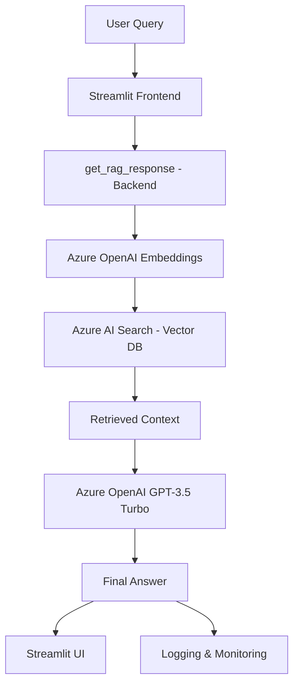

# Legal Assistant - Intelligent RAG-Based Application

A Retrieval-Augmented Generation (RAG) chatbot built with Azure OpenAI, LangChain, Streamlit, and Azure AI Search for providing legal assistance from uploaded documents.


---

## Project Overview

This project is a **Retrieval-Augmented Generation (RAG) Legal Assistant** chatbot that answers questions directly from uploaded legal documents (e.g., *The Law Handbook*).

### How It Works

1. Upload **PDF documents** and convert them into **embeddings**
2. Store embeddings in **Azure AI Search** (vector database)
3. User query is converted into embeddings and a **similarity search** is performed
4. Relevant chunks are retrieved and sent to **Azure OpenAI GPT-3.5 Turbo**
5. The model generates a **contextual legal response**
6. All interactions are captured via **logging, monitoring, and a feedback system**

> This is a complete, end-to-end RAG application showcasing MLOps, GenAI, and deployment workflows.

---

## Example Interactions

| Query | Response |
|-------|----------|
| *What is the title of the book?* | *The Law Handbook, 15th Edition* |
| *What is civil law?* | *Civil law is the type of law enforced by individuals, companies, or the government...* |
| *What is your name?* | *I cannot find the answer in the provided documents.* |

- Feedback system: mark responses as **Correct / Incorrect**
- Logs: all queries, responses, latency, and context are **stored for monitoring**

---

## Architecture



---

## Tech Stack

### Frontend

- **Streamlit** — clean, interactive chat interface
- **Feedback System** — correct/incorrect buttons for response monitoring

### Backend

- **LangChain** — orchestrating the RAG pipeline
- **Azure OpenAI (GPT-3.5 Turbo)** — final answer generation
- **Azure OpenAI Embeddings** — convert queries and documents into vectors
- **Azure AI Search (Vector DB)** — similarity search for retrieving relevant chunks

### Monitoring & Logging

- **Python Logging** — captures query, response, retrieved context, and latency
- **Session State (Streamlit)** — stores chat history across runs
- **Azure Monitoring** — tracks requests and usage

### Environment Management

- **.env file** — secure storage of Azure keys and endpoints
- **python-dotenv** — key management in backend

---

## Key Features

- **Document Upload & Vectorization** — supports long legal PDFs
- **Context-Aware Retrieval** — uses embeddings + vector search
- **LLM-Powered Answers** — Azure GPT-3.5 Turbo with context window handling
- **Conversation Logging** — stores queries, responses, context, and latency
- **Feedback System** — mark answers as correct/incorrect for improvement
- **Azure Cloud Integration** — embeddings, search, monitoring, LLM hosting
- **Low Latency Responses** — ~3-4s average response time

---

## Project Structure

```
├── frontend/
│   └── app.py                 # Streamlit UI
├── backend/
│   └── rag_core.py            # RAG pipeline core logic
├── .env                       # Environment variables (Azure keys, endpoints)
├── logs/
│   └── rag_logs.log           # Logging and monitoring
├── requirements.txt           # Dependencies
└── README.md                  # Project documentation
```

---

## Environment Variables

Create a `.env` file in the project root with the following variables:

```
AZURE_OPENAI_ENDPOINT=your_endpoint_here
AZURE_OPENAI_KEY=your_key_here
AZURE_SEARCH_ENDPOINT=your_search_endpoint
AZURE_SEARCH_KEY=your_search_key
AZURE_SEARCH_INDEX=your_index_name
```

---

## Installation & Setup

```bash
# Clone the repository
git clone https://github.com/yourusername/legal-assistant-rag.git
cd legal-assistant-rag

# Create a conda environment
conda create -n ragapp python=3.10 -y
conda activate ragapp

# Install dependencies
pip install -r requirements.txt

# Add your .env file with Azure keys and configs
```

Run the application:

```bash
streamlit run frontend/app.py
```

---

## Future Enhancements

- Support for multiple document uploads with chunk merging
- Integration with alternative vector databases (Pinecone, Weaviate, FAISS)
- Advanced feedback loop for continuous model improvement
- Deployment with Docker + CI/CD (GitHub Actions + Azure/AWS)

---

If you found this project useful, consider giving the repo a star!
