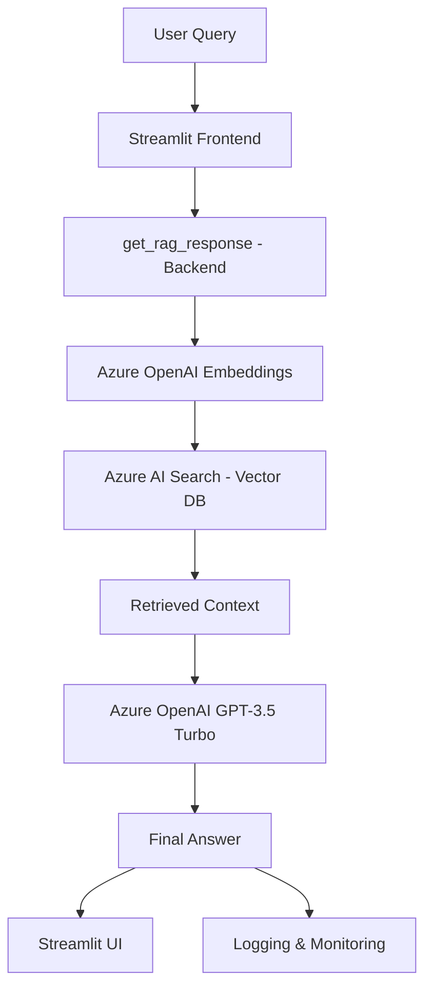

# ⚖️ Legal Assistant – RAG-based Chatbot

_A Retrieval-Augmented Generation (RAG) project built with Azure OpenAI, LangChain, Streamlit, and Azure AI Search_


---

## 🌟 Project Overview

This project is a **Retrieval-Augmented Generation (RAG) Legal Assistant** chatbot that provides legal assistance by answering questions directly from uploaded legal documents (e.g., _The Law Handbook_).

- Upload **PDF documents** → Convert them into **embeddings**
- Store embeddings in **Azure AI Search (Vector Database)**
- Query is converted into embeddings → Perform **similarity search**
- Relevant chunks retrieved → Sent to **Azure OpenAI GPT-3.5 Turbo**
- Model generates a **humanized legal response**
- Includes **logging, monitoring, and feedback system**

💡 _This is a complete, end-to-end RAG application showcasing MLOps, GenAI, and deployment workflows._

---

## 🎥 Demo

📽️ [Watch Full Demo Video](#) _(https://youtu.be/AGVy9Qeb_YI?si=D22kTrcpuTvGuuza)_

**Example Interactions:**

- _Q: What is the title of the book?_ → A: _The Law Handbook, 15th Edition_
- _Q: What is civil law?_ → A: _Civil law is the type of law enforced by individuals, companies, or the government…_
- _Q: What is your name?_ → A: _I cannot find the answer in the provided documents._

✅ Feedback system: Mark responses as **Correct/Incorrect**
✅ Logs: All queries, responses, latency, and context are **stored for monitoring**

---

## 🏗️ Architecture



---

## ⚙️ Tech Stack

### 🖥️ Frontend

- **Streamlit**: Clean, interactive chat interface
- **Feedback System**: Correct/Incorrect buttons for monitoring

### ⚡ Backend

- **LangChain**: Orchestrating RAG pipeline
- **Azure OpenAI (GPT-3.5 Turbo)**: Final answer generation
- **Azure OpenAI Embeddings**: Convert queries and documents into vectors
- **Azure AI Search (Vector DB)**: Similarity search to retrieve relevant chunks

### 📊 Monitoring & Logging

- **Python Logging**: Captures query, response, retrieved context, latency
- **Session State (Streamlit)**: Stores chat history across runs
- **Azure Monitoring**: Tracks requests and usage

### 🔐 Environment Management

- **.env file**: Secure storage of Azure keys & endpoints
- **os & dotenv**: Key management in backend

---

## 🚀 Key Features

- 📄 **Document Upload & Vectorization** – Supports long legal PDFs
- 🔍 **Context-Aware Retrieval** – Uses embeddings + vector search
- 🤖 **LLM-Powered Answers** – Azure GPT-3.5 Turbo with context window handling
- 📝 **Conversation Logging** – Stores queries, responses, context, and latency
- ✅ **Feedback System** – Mark answers as correct/incorrect for improvement
- 🌐 **Azure Cloud Integration** – Embeddings, search, monitoring, LLM hosting
- ⚡ **Low Latency Responses** – \~3–4s average response time

---

## 📂 Project Structure

```
├── frontend/
│   └── app.py                 # Streamlit UI
├── backend/
│   └── rag_core.py            # RAG pipeline core logic
├── .env                       # Environment variables (Azure keys, endpoints)
├── logs/
│   └── rag_logs.log           # Logging and monitoring
├── requirements.txt           # Dependencies
└── README.md                  # Project Documentation
```

---

## 🔑 Environment Variables (.env)

```
AZURE_OPENAI_ENDPOINT=your_endpoint_here
AZURE_OPENAI_KEY=your_key_here
AZURE_SEARCH_ENDPOINT=your_search_endpoint
AZURE_SEARCH_KEY=your_search_key
AZURE_SEARCH_INDEX=your_index_name
```

---

## 🛠️ Installation & Setup

```bash
# Clone repo
git clone https://github.com/yourusername/legal-assistant-rag.git
cd legal-assistant-rag

# Create env
conda create -n ragapp python=3.10 -y
conda activate ragapp

# Install dependencies
pip install -r requirements.txt

# Add your .env file
touch .env   # Add keys & configs
```

Run the Streamlit app:

```bash
streamlit run frontend/app.py
```

---

## 📈 Future Enhancements

- 🔹 Support for multiple document uploads with chunk merging
- 🔹 Integration with **vector DB alternatives** (Pinecone, Weaviate, FAISS)
- 🔹 Advanced **feedback loop** for continuous model improvement
- 🔹 Deployment with **Docker + CI/CD (GitHub Actions + Azure/AWS)**

---

## 👨‍💻 Author

**Adeel Hamid** – _AI | Data Science | MLOps | GenAI Engineer_
🔗 [LinkedIn](www.linkedin.com/in/adeelhamid) | 📧 (mailto:adeel.hamid50@gmail.com) | 🌐 Portfolio: (www.skillihire.com)

---

✨ _If you found this project useful, don’t forget to ⭐ the repo!_

---
